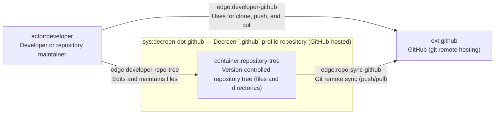
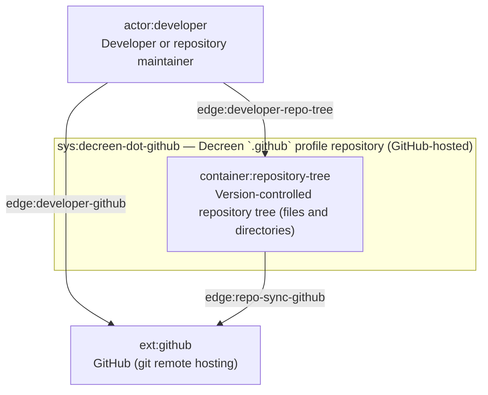
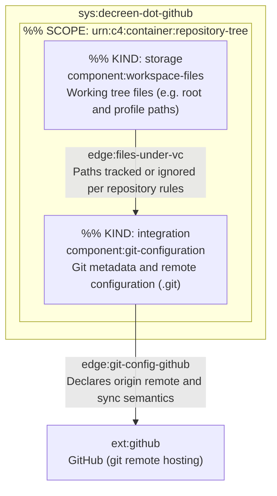

# C4 Architecture

_Derived by replaying `docs/c4-events.ndjson` through Pass 4 freeze (`final_render`)._

## L1 — System context

## L2 — Containers

## L3 — Components (selected container)

## Containment map

| ID | Kind | Contained in |
|----|------|----------------|
| `sys:decreen-dot-github` | system | — |
| `container:repository-tree` | container | `sys:decreen-dot-github` |
| `component:workspace-files` | component (`storage`) | `container:repository-tree` |
| `component:git-configuration` | component (`integration`) | `container:repository-tree` |
