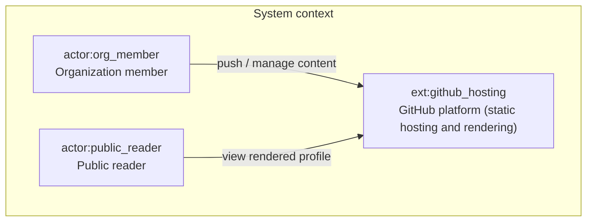
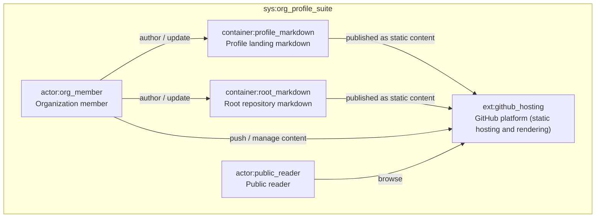
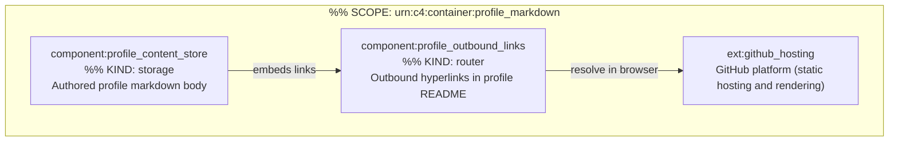
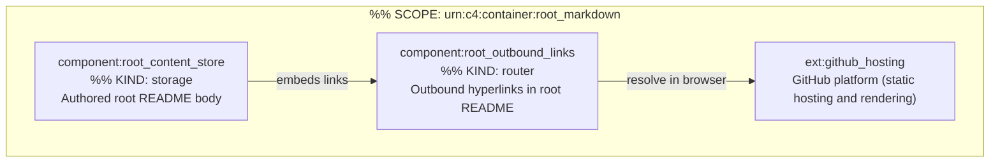

# C4 Architecture

Derived from `docs/c4-events.ndjson` (append-only stream). Pass 4 adds no new elements.

## L1 — System context



## L2 — Containers

_System boundary: **sys:org_profile_suite** — Organization profile and repository documentation_



## L3 — container:profile_markdown



## L3 — container:root_markdown



## Containment Map

```json
{
  "parentToChildren": {
    "sys:org_profile_suite": ["container:profile_markdown", "container:root_markdown"],
    "container:profile_markdown": ["component:profile_content_store", "component:profile_outbound_links"],
    "container:root_markdown": ["component:root_content_store", "component:root_outbound_links"]
  },
  "childToParent": {
    "container:profile_markdown": "sys:org_profile_suite",
    "container:root_markdown": "sys:org_profile_suite",
    "component:profile_content_store": "container:profile_markdown",
    "component:profile_outbound_links": "container:profile_markdown",
    "component:root_content_store": "container:root_markdown",
    "component:root_outbound_links": "container:root_markdown"
  }
}
```
