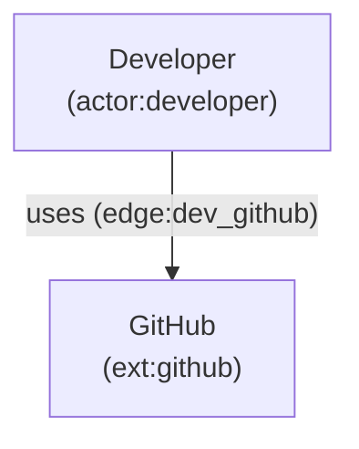

# Live C4 Preview

```mermaid
flowchart TD
  actor_developer["Developer<br/>(actor:developer)"]
  ext_github["GitHub<br/>(ext:github)"]
  actor_developer -->|"uses (edge:dev_github)"| ext_github
```
