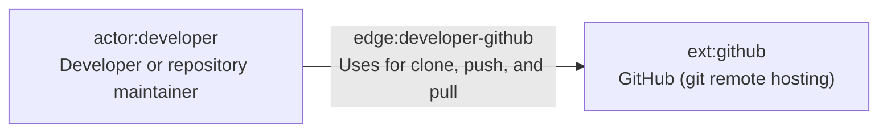

# Live C4 Preview

_Pass 1 — L1 context (from stream replay)._

```mermaid
flowchart LR
  actor_developer["actor:developer<br/>Developer or repository maintainer"]
  ext_github["ext:github<br/>GitHub (git remote hosting)"]
  actor_developer -->|"edge:developer-github<br/>Uses for clone, push, and pull"| ext_github
```
