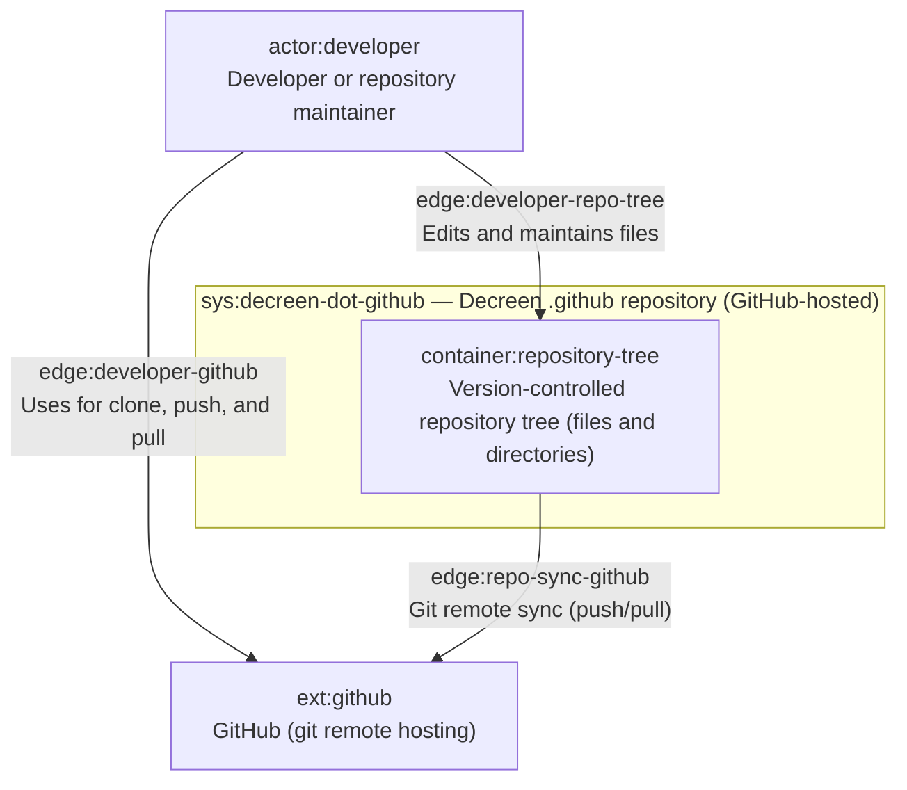

# Live C4 Preview

_Pass 2 — L1 context + L2 containers (from stream replay)._

```mermaid
flowchart TB
  subgraph sys_decreen["sys:decreen-dot-github — Decreen .github repository (GitHub-hosted)"]
    container_repo["container:repository-tree<br/>Version-controlled repository tree (files and directories)"]
  end
  actor_developer["actor:developer<br/>Developer or repository maintainer"]
  ext_github["ext:github<br/>GitHub (git remote hosting)"]
  actor_developer -->|"edge:developer-github<br/>Uses for clone, push, and pull"| ext_github
  actor_developer -->|"edge:developer-repo-tree<br/>Edits and maintains files"| container_repo
  container_repo -->|"edge:repo-sync-github<br/>Git remote sync (push/pull)"| ext_github
```
