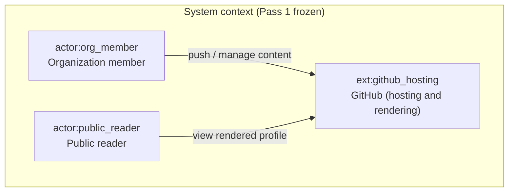

# Live C4 Preview

```mermaid
flowchart TD
  subgraph L1["System context (Pass 1 frozen)"]
    actor_org_member["actor:org_member<br/>Organization member"]
    actor_public_reader["actor:public_reader<br/>Public reader"]
    ext_github_hosting["ext:github_hosting<br/>GitHub (hosting and rendering)"]
  end
  actor_org_member -->|push / manage content| ext_github_hosting
  actor_public_reader -->|view rendered profile| ext_github_hosting
```
