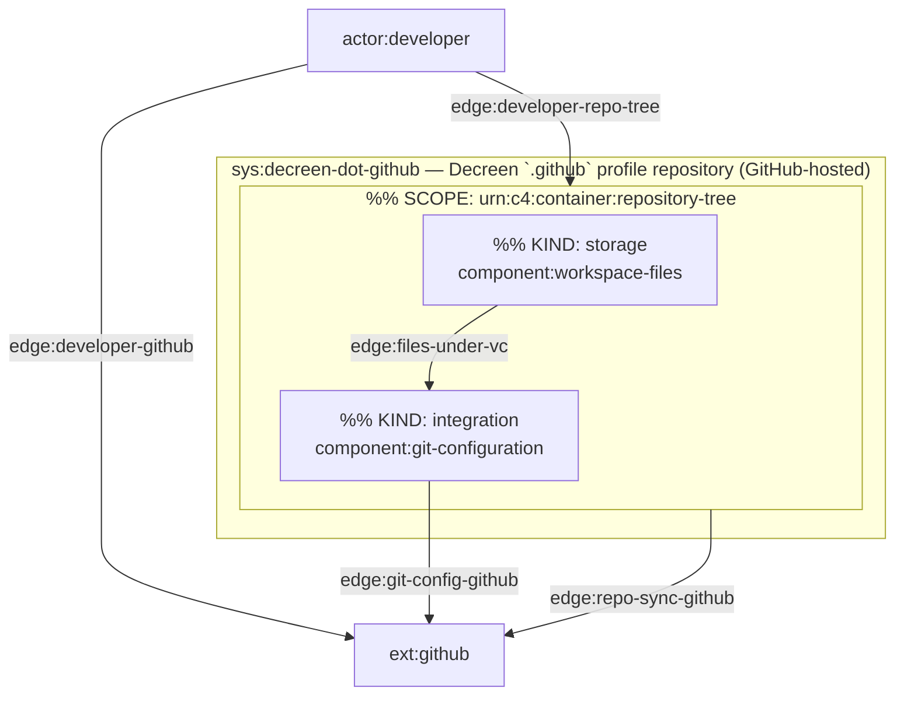

# Live C4 Preview

_Final projection (Pass 4); matches `docs/c4-architecture.mermaid.md` structure._

```mermaid
flowchart TB
  subgraph sys_decreen["sys:decreen-dot-github — Decreen `.github` profile repository (GitHub-hosted)"]
    subgraph container_repo["%% SCOPE: urn:c4:container:repository-tree"]
      comp_files["%% KIND: storage<br/>component:workspace-files"]
      comp_git["%% KIND: integration<br/>component:git-configuration"]
      comp_files -->|"edge:files-under-vc"| comp_git
    end
  end
  actor_developer["actor:developer"]
  ext_github["ext:github"]
  actor_developer -->|"edge:developer-github"| ext_github
  actor_developer -->|"edge:developer-repo-tree"| container_repo
  container_repo -->|"edge:repo-sync-github"| ext_github
  comp_git -->|"edge:git-config-github"| ext_github
```
