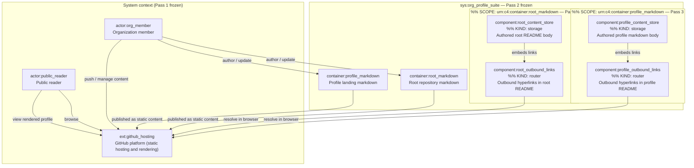

# Live C4 Preview

```mermaid
flowchart TD
  subgraph L1["System context (Pass 1 frozen)"]
    actor_org_member["actor:org_member<br/>Organization member"]
    actor_public_reader["actor:public_reader<br/>Public reader"]
    ext_github_hosting["ext:github_hosting<br/>GitHub platform (static hosting and rendering)"]
  end
  subgraph L2["sys:org_profile_suite — Pass 2 frozen"]
    container_profile_markdown["container:profile_markdown<br/>Profile landing markdown"]
    container_root_markdown["container:root_markdown<br/>Root repository markdown"]
    subgraph L3p["%% SCOPE: urn:c4:container:profile_markdown — Pass 3"]
      component_profile_content_store["component:profile_content_store<br/>%% KIND: storage<br/>Authored profile markdown body"]
      component_profile_outbound_links["component:profile_outbound_links<br/>%% KIND: router<br/>Outbound hyperlinks in profile README"]
    end
    subgraph L3r["%% SCOPE: urn:c4:container:root_markdown — Pass 3"]
      component_root_content_store["component:root_content_store<br/>%% KIND: storage<br/>Authored root README body"]
      component_root_outbound_links["component:root_outbound_links<br/>%% KIND: router<br/>Outbound hyperlinks in root README"]
    end
  end
  actor_org_member -->|push / manage content| ext_github_hosting
  actor_public_reader -->|view rendered profile| ext_github_hosting
  actor_org_member -->|author / update| container_profile_markdown
  actor_org_member -->|author / update| container_root_markdown
  container_profile_markdown -->|published as static content| ext_github_hosting
  container_root_markdown -->|published as static content| ext_github_hosting
  actor_public_reader -->|browse| ext_github_hosting
  component_profile_content_store -->|embeds links| component_profile_outbound_links
  component_root_content_store -->|embeds links| component_root_outbound_links
  component_profile_outbound_links -->|resolve in browser| ext_github_hosting
  component_root_outbound_links -->|resolve in browser| ext_github_hosting
```
