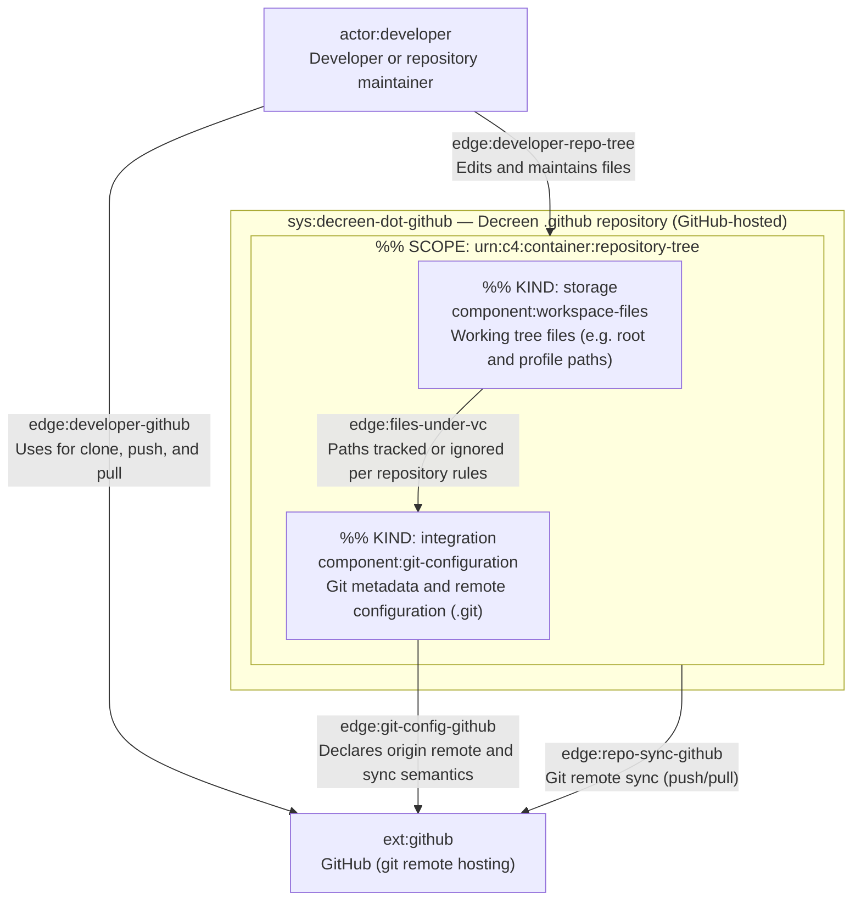

# Live C4 Preview

_Pass 3 — L1 + L2 + L3 for selected container (from stream replay)._

```mermaid
flowchart TB
  subgraph sys_decreen["sys:decreen-dot-github — Decreen .github repository (GitHub-hosted)"]
    subgraph container_repo["%% SCOPE: urn:c4:container:repository-tree"]
      comp_files["%% KIND: storage<br/>component:workspace-files<br/>Working tree files (e.g. root and profile paths)"]
      comp_git["%% KIND: integration<br/>component:git-configuration<br/>Git metadata and remote configuration (.git)"]
      comp_files -->|"edge:files-under-vc<br/>Paths tracked or ignored per repository rules"| comp_git
    end
  end
  actor_developer["actor:developer<br/>Developer or repository maintainer"]
  ext_github["ext:github<br/>GitHub (git remote hosting)"]
  actor_developer -->|"edge:developer-github<br/>Uses for clone, push, and pull"| ext_github
  actor_developer -->|"edge:developer-repo-tree<br/>Edits and maintains files"| container_repo
  comp_git -->|"edge:git-config-github<br/>Declares origin remote and sync semantics"| ext_github
  container_repo -->|"edge:repo-sync-github<br/>Git remote sync (push/pull)"| ext_github
```
